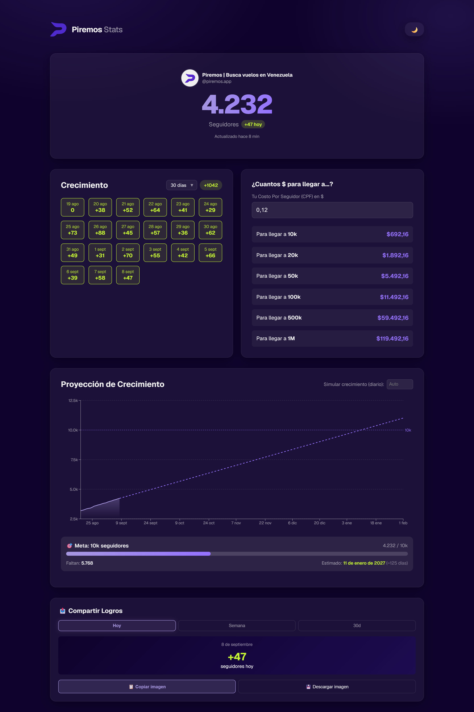
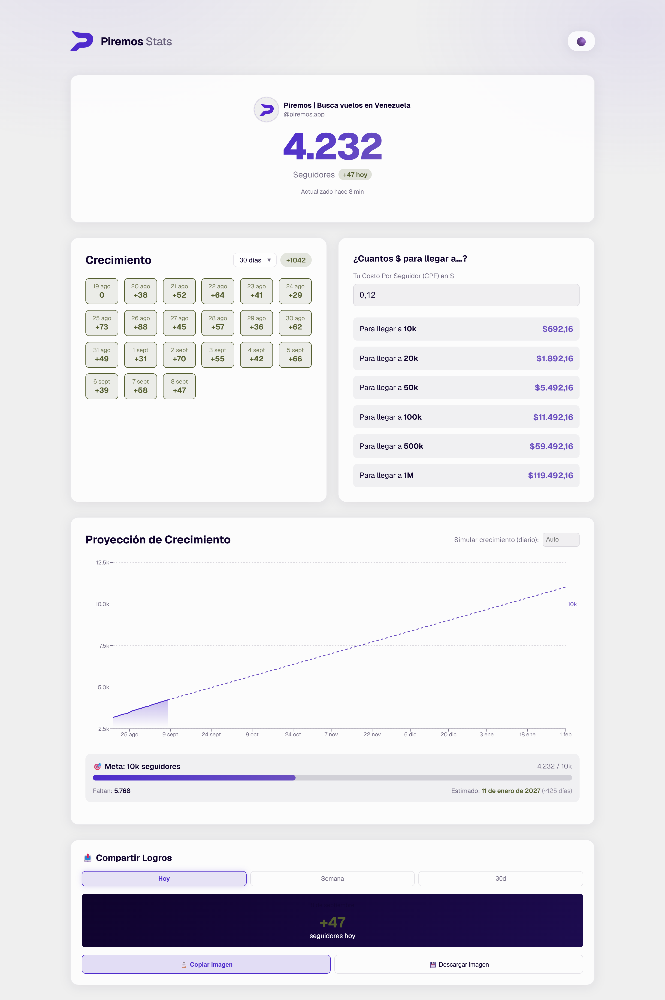
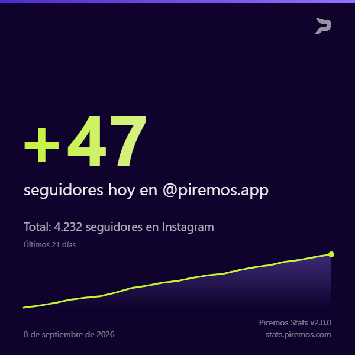

# Instagram Growth Dashboard

Un dashboard para una sola cuenta de Instagram: cuántos seguidores tienes hoy, cuántos ganaste, cuánto te falta para la próxima meta y cuándo vas a llegar. Corre entero en Vercel, sin servidor propio y sin base de datos.

Está desplegado como **[stats.piremos.com](https://stats.piremos.com)** para [@piremos.app](https://instagram.com/piremos.app), pero el repo no está atado a esa marca: nombre, logos, dominio, cuenta y **paleta completa** salen de variables de entorno.



---

## Qué hace

| | |
|---|---|
| **Contador en vivo** | Seguidores actuales con el cambio del día, foto y nombre reales de la cuenta |
| **Calendario de crecimiento** | Un cuadro por día, navegable por mes, con el neto del período |
| **Calculadora de CPF** | Metes tu costo por seguidor y te dice cuánto cuesta llegar a 10k, 20k, 50k, 100k, 500k y 1M |
| **Proyección** | Media móvil exponencial sobre el histórico, con la fecha estimada de la próxima meta |
| **Imagen para compartir** | Genera un PNG cuadrado con el crecimiento del día, la semana o el mes, listo para publicar |
| **Claro y oscuro** | Dos temas reales, derivados de la misma paleta |

<table>
<tr>
<td width="50%"></td>
<td width="50%"></td>
</tr>
<tr>
<td align="center"><em>Modo claro</em></td>
<td align="center"><em>La imagen que genera para redes</em></td>
</tr>
</table>

---

## Cómo funciona

```
Vercel Cron ──┐
              ├──▶  /api/followers  ──▶  caché (TTL 2 h)  ──▶  Apify Actor  ──▶  Instagram
Navegador  ───┘            │
                           └──▶  Vercel Blob  ──▶  history.json · cache.json
```

**El scraping** lo hace un Actor de Apify, invocado desde TypeScript con `apify-client`. Cuesta unos **$0,0036 por corrida**; con caché de 2 horas son ~$1,30 al mes.

**La caché** evita pagar por cada visita. Un pedido dentro de la ventana de 2 horas se sirve de lo guardado sin tocar Apify. Si el scrape falla y hay algo en caché, se devuelve el valor viejo con un backoff de 15 minutos en vez de un error.

**El histórico** es acumulativo y no se reconstruye: si falta un día, falta para siempre. Por eso hay un cron que corre cada 2 horas a los `:55`, lo que además hace que una de esas corridas caiga a las **23:55 hora de Venezuela** — la ventana en la que se registra el número con el que cierra el día, aunque nadie haya abierto la página.

**La persistencia** elige backend sola: con `BLOB_READ_WRITE_TOKEN` escribe en Vercel Blob, sin ella en `data/*.json` en disco. El mismo código corre en Vercel y en un VPS.

Más detalle en [`docs/ARCHITECTURE.md`](docs/ARCHITECTURE.md).

---

## Correrlo local

```bash
git clone https://github.com/josuebustosn/ig-growth.git
cd ig-growth
npm install
cp .env.example .env.local     # y pon tu APIFY_TOKEN
npm run dev
```

Sin `BLOB_READ_WRITE_TOKEN` guarda en `data/`, que está ignorado por git. Con solo el token de Apify configurado ya funciona: el resto tiene valores por defecto.

---

## Usarlo con tu marca

No hace falta tocar código. Pon tus archivos en `public/` y configura estas variables:

```bash
NEXT_PUBLIC_BRAND_NAME=TuMarca
NEXT_PUBLIC_INSTAGRAM_USERNAME=tucuenta
NEXT_PUBLIC_SHARE_DOMAIN=stats.tumarca.com

NEXT_PUBLIC_BRAND_HEADER_LOGO=/tu-logo.png
NEXT_PUBLIC_BRAND_FAVICON=/tu-icono.svg
NEXT_PUBLIC_BRAND_CANVAS_LOGO=/tu-logo-blanco.png

# Toda la interfaz se deriva de estos seis
NEXT_PUBLIC_BRAND_PRIMARY=4E2BCC
NEXT_PUBLIC_BRAND_ACCENT=9471FF
NEXT_PUBLIC_BRAND_POSITIVE=C4F333
NEXT_PUBLIC_BRAND_NEGATIVE=FF6B6B
NEXT_PUBLIC_BRAND_DARK=0F032D
NEXT_PUBLIC_BRAND_LIGHT=EFEFEF
```

Los seis colores se entregan a CSS una vez, en `app/layout.tsx`, y `globals.css` deriva de ahí cada sombra, borde, tinte y estado con `color-mix()`. **Ningún componente contiene un color literal**, así que una marca nueva son seis valores y tus logos — no una pasada por cada archivo.

Los dos temas tratan esos colores distinto, y tiene que ser así: el púrpura `#4E2BCC` sobre el fondo oscuro da ~1,6:1 y no se lee, así que el modo oscuro lo aclara hacia el color claro hasta pasar AA. El lime `#C4F333` es el caso opuesto —brillante sobre oscuro, invisible sobre claro—, así que el modo claro lo oscurece. Eso se deriva, no se lista, para que funcione con cualquier paleta y no solo con esta.

> **Los colores se aceptan con o sin `#`.** En un archivo `.env` el `#` abre un comentario, así que `NEXT_PUBLIC_BRAND_PRIMARY=#4E2BCC` llegaría vacío y caería al valor por defecto sin avisar. Se acepta la forma pelada para que no haya trampa.

> ⚠️ Todas las `NEXT_PUBLIC_*` se **inlinean en tiempo de build**. Configúralas antes del primer deploy; cambiar una después exige redeploy, no alcanza con editarla en el panel.

---

## Desplegarlo

Guía completa en [`docs/DEPLOYMENT.md`](docs/DEPLOYMENT.md). El resumen:

1. Importa el repo en Vercel
2. Crea un Blob store **privado** y conéctalo al proyecto
3. Carga `APIFY_TOKEN`, `NEXT_PUBLIC_INSTAGRAM_USERNAME` y `CRON_SECRET`
4. Deploy — los crons de `vercel.json` se activan solos
5. **Verifica que `BLOB_READ_WRITE_TOKEN` esté puesta**

El paso 5 no es burocracia: si esa variable falta, la app **no falla**. Cae al backend de disco, responde 200 con toda normalidad, y el histórico se borra en cada cold start sin un solo error en los logs.

---

## Stack

Next.js 16 (App Router) · React 19 · TypeScript · Recharts · Vercel Blob · Apify

Sin base de datos y sin dependencias de UI: los estilos son CSS plano con custom properties, y los componentes están escritos a mano.

---

## Decisiones que quizás llamen la atención

**La ruta ignora el query string.** `/api/followers` no recibe la cuenta por parámetro: la lee del entorno. Antes venía de `?username=`, lo que significaba que cualquiera podía hacer que este despliegue scrapeara la cuenta que quisiera — cada una facturada a nuestro crédito de Apify, y agregada para siempre a un `history.json` compartido. Con la cuenta fija no hace falta rate limiting.

**El histórico usa compare-and-swap, la caché no.** Cada escritura reemplaza el documento entero, así que una actualización perdida en `history.json` se llevaría entradas de otros días. La caché va last-write-wins a propósito: es reconstruible, y perder una escritura cuesta un scrape, no un registro.

**Un documento ilegible se trata distinto según cuál sea.** Si `history.json` existe pero no parsea, se lanza y no se toca: es el único registro que no se puede rehacer. Si es `cache.json`, se sigue como si estuviera vacío: una caché ilegible es un cache miss.

**Un solo cron, no dos.** Vercel registra **una** entrada por path: dos definiciones apuntando a la misma ruta no corren las dos, y la segunda nunca dispara sin decirlo. Por eso hay un único schedule que cubre los dos trabajos.

**Y los crons van en UTC.** Venezuela es UTC-4, así que la ventana de cierre de día (23:50–23:59 local) son las 03:50–03:59 UTC. El schedule dispara a los `:55` de cada hora impar: doce corridas al día, con una a las `03:55 UTC` = 23:55 local. Escrito como `23:55` erraría la ventana en silencio.

---

## Licencia

MIT — ver [LICENSE](LICENSE).
